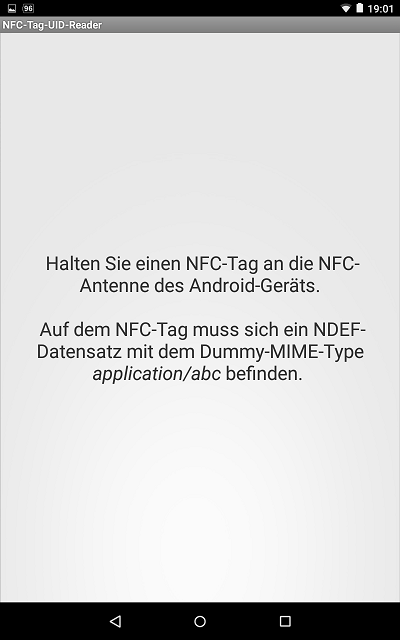
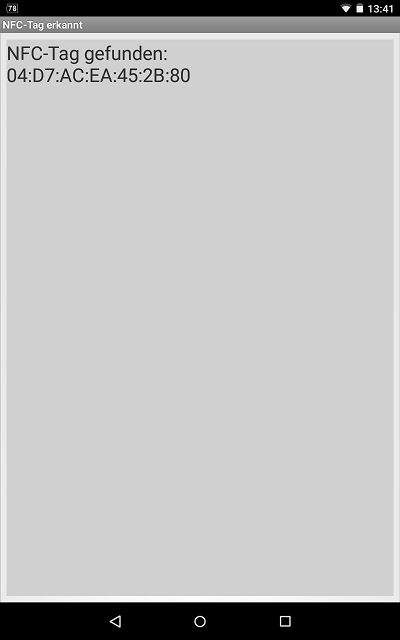

# Android-App: UID von NFC-Tag auslesen

Source code for an Android app that shows how to read out the UID of an [NFC](https://developer.android.com/guide/topics/connectivity/nfc/) tag with the custom mime type `application/abc`.

 

Identifiers (names for classes, variables and methods) and UI texts are in German only.

 

----
## Screenshots

  

Screenshots were taken from emulator.

 

----
# License

See the [LICENSE file](LICENSE.md) for license rights and limitations (BSD 3-Clause License).
